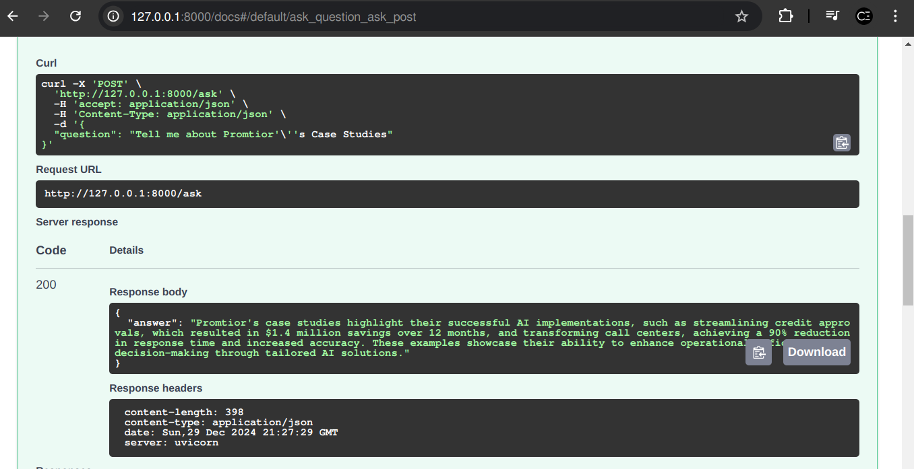

# RAG API endpoint using Langchain and OpenAI API

RAG API endpoint using Langchain, Langsmith, beautifulsoup4, deployed with Azure

The chatbot is going to answer questions about **Promtior.ai** company:
* https://www.promtior.ai/

## Live demo

### Backend

API Endpoints URL: [Live API URL](https://rag-api-promtior-bjepewbwhef2crgz.eastus-01.azurewebsites.net/)

```sh
{
  "question": "Tell me about Promtior's Case Studies"
}
```




**Langsmith traces:** 

* [Langsmith traces](https://smith.langchain.com/public/1e9b8603-bafb-456f-b812-7f1e461f170c/r)

**Docker hub image**

* [Docker hub image](https://hub.docker.com/r/cristianencalada/rag-api-promtior)

```
docker pull cristianencalada/rag-api-promtior
```

## Requirements

1. Have a valid OpenAI Key. Check [platform.openai.com/api-keys](https://platform.openai.com/api-keys)

2. Python installed (e.g. Python 3.12.7)

```sh
python --version
```

3. __Recomemnded__, have virtual environments (venv) for Python [Python vev documentation](https://docs.python.org/3/library/venv.html)

4. Create a .env file with the following variables. SImilar to the file [.env.example](./backend/.env.example):

```sh
LANGCHAIN_TRACING_V2=true
LANGSMITH_API_KEY="lsv2_pt_xxxxxx"
OPENAI_API_KEY="sk-proj-xxxxxxxx"
```

## Run backend locally (without Docker)

1. Create a virtual environment in the /backend directory

```sh
python -m venv venv
```

1.1. Activate the virtual environment - Windows

```sh
.\venv\Scripts\activate
```

1.2. Activate the virtual environment - Linux

```sh
source ./venv/bin/activate
```

2. Install python dependency packages:

```
pip install -r requirements.txt
```

3. Launch FastAPI

```sh
uvicorn app:app
```

Output
```sh
INFO:     Started server process [6944]
INFO:     Waiting for application startup.
INFO:     Application startup complete.
INFO:     Uvicorn running on http://127.0.0.1:8000 (Press CTRL+C to quit)
```

## Run backend with Dockerfile

1. Build the docker image

```
docker build -t rag-web-langchain-back .
```

2. Run the docker image

```
docker run -p 8000:8000 rag-web-langchain-back
```

The Fast API endpoints should be running at:

```sh
http://127.0.0.1:8000/docs
```

## Author

Cristian Encalada - [Linkedin](https://www.linkedin.com/in/cristian-encalada/)

## Acknowledgements

* https://python.langchain.com/v0.2/docs/tutorials/rag/
