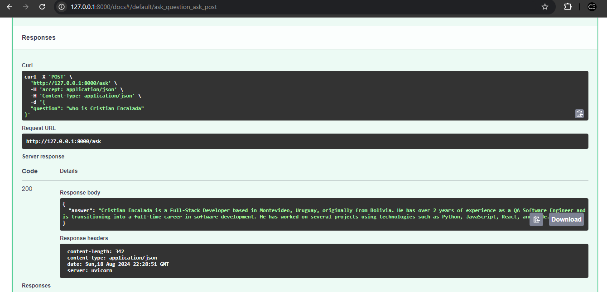

# RAG Chatbot using Langchain and OpenAI API

Web RAG chatbot using Langchain and Langserve, deployed using Railway

## Live demo

Playground UI URL: [Live demo](https://ragchatbotlangchainrailway-production.up.railway.app/chatbot/playground/)


API Endpoints URL: [Live API URL](https://ragchatbotlangchainrailway-production.up.railway.app/docs)




## Requirements

1. Have a valid OpenAI Key. Check [platform.openai.com/api-keys](https://platform.openai.com/api-keys)
2. Have a valid Tavily key. Check [Tavily AI](https://tavily.com/)
3. Python version __3.10.11__ or previous. With new versions of Python, such as 3.12, the Railway deployment is going to have errors. Verify it with:

```sh
python --version
Python 3.10.11
```

4. __Recomemnded__, have virtual environments (venv) for Python [Python vev documentation](https://docs.python.org/3/library/venv.html)

## Set up to run locally

1. Create a virtual environment
```sh
virtualenv venv
```

```sh
.\venv\Scripts\activate
```

Output
```sh
(venv) PS C:\Users\cristian\RAG_chatbot_Langchain_railway> 
```

2. Install python dependency packages:

```
pip install langchain
pip install langchain-cli
pip install langserve
pip install langchain-openai
pip install langchain-community
tavily-python
python-dotenv
```
3. Create a .env file for the API Keys. Use the [env_example](./env_example) as reference.
```
OPENAI_API_KEY=<YOUR_OPENAI_KEY>
TAVILY_API_KEY=<YOUR_TAVILY_KEY>
```

## Launch LangServe

```sh
langchain serve
```

Output
```
(venv) PS C:\Users\josee\OneDrive\Desktop\RAG_chatbot_Langchain> langchain serve
INFO:     Will watch for changes in these directories: ['C:\\Users\\josee\\OneDrive\\Desktop\\RAG_chatbot_Langchain']
INFO:     Uvicorn running on http://127.0.0.1:8000 (Press CTRL+C to quit)
INFO:     Started reloader process [10552] using StatReload
INFO:     Started server process [4700]
INFO:     Waiting for application startup.

 __          ___      .__   __.   _______      _______. _______ .______     ____    ____  _______
|  |        /   \     |  \ |  |  /  _____|    /       ||   ____||   _  \    \   \  /   / |   ____|
|  |       /  ^  \    |   \|  | |  |  __     |   (----`|  |__   |  |_)  |    \   \/   /  |  |__
|  |      /  /_\  \   |  . `  | |  | |_ |     \   \    |   __|  |      /      \      /   |   __|
|  `----./  _____  \  |  |\   | |  |__| | .----)   |   |  |____ |  |\  \----.  \    /    |  |____
|_______/__/     \__\ |__| \__|  \______| |_______/    |_______|| _| `._____|   \__/     |_______|

LANGSERVE: Playground for chain "/chatbot/" is live at:
LANGSERVE:  │
LANGSERVE:  └──> /chatbot/playground/
LANGSERVE:
LANGSERVE: See all available routes at /docs/

LANGSERVE: ⚠️ Using pydantic 2.6.4. OpenAPI docs for invoke, batch, stream, stream_log endpoints will not be generated. API endpoints and playgrouund should work as expected. If you need to see the docs, you can downgrade to pydantic 1. For example, `pip install pydantic==1.10.13`. See https://github.com/tiangolo/fastapi/issues/10360 for details.

INFO:     Application startup complete.
```

__API endpoints
__
```sh
http://127.0.0.1:8000/docs
```

Chatbot Playground UI

```sh
http://127.0.0.1:8000/chatbot/playground/
```

For more details about the implementation take a look at [/doc](./doc/) directory.

## Author

Cristian Encalada - [Linkedin](https://www.linkedin.com/in/cristian-encalada/)