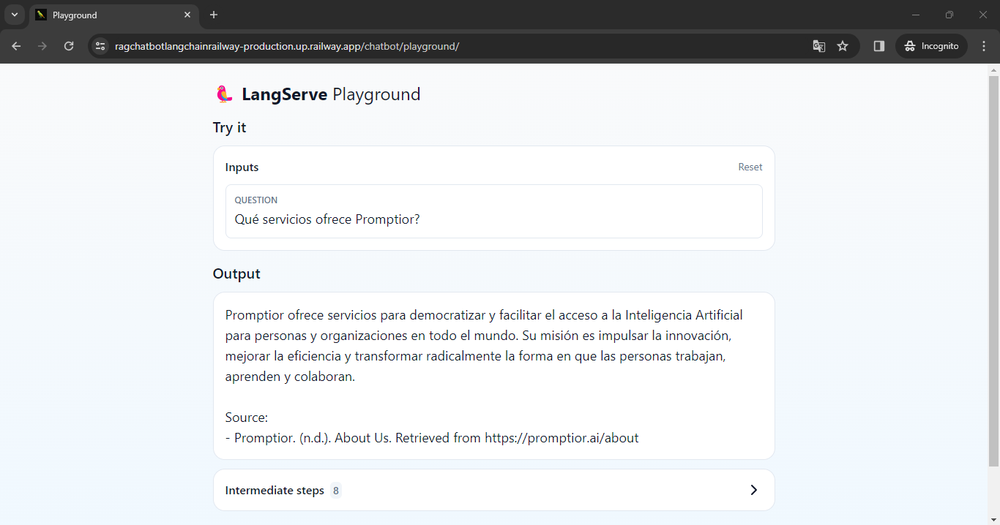

# Implementación

## Objetivo

Se desarrolló y desplegó un asistente chatbot utilizando la arquitectura RAG para responder preguntas sobre el contenido del sitio web de Promptior, basándose en la librería __LangChain__.

## Funcionalidad

El chatbot es capaz de responder las siguientes preguntas:
- Qué servicios ofrece Promptior?

- Cuándo fue fundada la empresa?

## Tecnologías utilizadas

Se Implementó la solución utilizando LangChain con Langserve:
- [Quickstart | 🦜🔗 Langchain](https://python.langchain.com/docs/get_started/quickstart)
- Se utilizó la API de OpenAI
- Python como lenguage de programación

## Despliegue

Se realizó el deployment de la solución a través de la plataforma [Railway](https://railway.app/).

## Descripción general del proyecto

Para abordar el proyecto, se siguieron los siguientes pasos:

1. Investigar sobre RAG y LLMs, tener claros estos conceptos es fundamental para proceder posteriormente con la implementación.

#### RAG

Retrieval-augmented generation (RAG) is a technique for enhancing the accuracy and reliability of generative AI models with facts fetched from external sources.

__Fuente:__ https://blogs.nvidia.com/blog/what-is-retrieval-augmented-generation/

#### LLMs

A large language model (LLM) is a type of artificial intelligence (AI) program that can recognize and generate text, among other tasks. LLMs are trained on huge sets of data. 

In simpler terms, an LLM is a computer program that has been fed enough examples to be able to recognize and interpret human language or other types of complex data. 

__Fuente:__ https://www.cloudflare.com/learning/ai/what-is-large-language-model/

2. Investigar sobre la tecnologia __LangChain__, que es un framework para desarrollar aplicaciones enfocadas en LMs(Language Models), comenzar con una visión global y proceder con temas más específicos como __LangServe__, que es una librería para desplegar cadenas o "chains" de Langchain como APIs REST.

#### Langchain

__LangChain__ is a framework for developing applications powered by language models. It enables applications that:

- __Are context-aware__: connect a language model to sources of context (prompt instructions, few shot examples, content to ground its response in, etc.)
- __Reason__: rely on a language model to reason (about how to answer based on provided context, what actions to take, etc.)

This framework consists of several parts.

- LangChain Libraries: The Python and JavaScript libraries. Contains interfaces and integrations for a myriad of components, a basic run time for combining these components into chains and agents, and off-the-shelf implementations of chains and agents.
- [LangChain Templates](https://python.langchain.com/docs/templates): A collection of easily deployable reference architectures for a wide variety of tasks.
- [LangServe](https://python.langchain.com/docs/langserve): A library for deploying LangChain chains as a REST API.
- [LangSmith](https://python.langchain.com/docs/langsmith): A developer platform that lets you debug, test, evaluate, and monitor chains built on any LLM framework and seamlessly integrates with LangChain.

__Fuente:__ https://python.langchain.com/docs/get_started/introduction

3. Anazilar la arquitectura específica para Chatbots utilizando la tecnología __Langchain__, que podemos ver a continuación: 

__Fuente:__ https://python.langchain.com/docs/use_cases/chatbots/

4. Comparar diferentes opciones para el "search engine" del chatbot. La recomendad por la documentación es [Tavily Search API](https://python.langchain.com/docs/integrations/retrievers/tavily), pero existen otros como [exa.ai](https://exa.ai/) o [Faiss](https://python.langchain.com/docs/integrations/vectorstores/faiss)

Se escogió __Tavily Search API__ por simplicidad.

### Desafios

1. El desafío más importante fue aprender diferentes tecnologías yconceptos nuevos en un tiempo determinado, a pesar de que son temas relativamente amplios, gracias a que la documentación disponible es bastante completa no hubo complicaciones en este aspecto.

2. Un desafío técnico importante surgió utilizando Python:
- El proyecto estaba listo con la versión más reciente de [Python 3.12.2](https://www.python.org/downloads/), sin embargo, la realizar el deployment en Railway, surgieron diferentes errores de compatibilidad, ya que la plataforma utiliza la versión __3.10.11__.
- No utilizar __venv__ fue un error bastante grande, ya que llevó mucho más tiempo hacer el downgrade y reinstalar todas las dependencias de python con la versión __3.10.11__. La reinstalación fue necesaria debido a que se utiliza poetry para el deployment en Railway.
- Este desafío se resolvió reinstalando todas las dependencias utilizando Poetry y venv con la versión 3.10.11 de Python, ya que el archivo poetry.lock depende de la versión de python.

## Diagrama de componentes

__Breve explicación:__

La parte superior del diagrama explica de manera general el proceso de extracción de información de diferentes sitios, en este caso específico está centrado en la página de Promptior, pero la información se puede extraer de mútiples websites en base al caso de uso específico.

En la parte inferior se observa la interacción del usuario, en este caso, al realizar una pregunta, se consuta un Embedding API, para este proyecto se utiliza la API de GPT 3.5, posteriormente se hace la búsqueda semántica en un vectorstore, en este caso seleccionamos Tavily para la implementación, finalmente se devuelven los "ranked" results al LLM para ser procesada y esta información se devuelve como una respuesta al usuario.

## Referencias

- Doc Langserv deployment: https://python.langchain.com/docs/langserve#deployment

Langchain architecture:

https://python.langchain.com/docs/get_started/introduction

Langchain chatbot:

https://python.langchain.com/docs/use_cases/chatbots/

Video to understand better Langchain architecture:
https://www.youtube.com/watch?v=TLf90ipMzfE